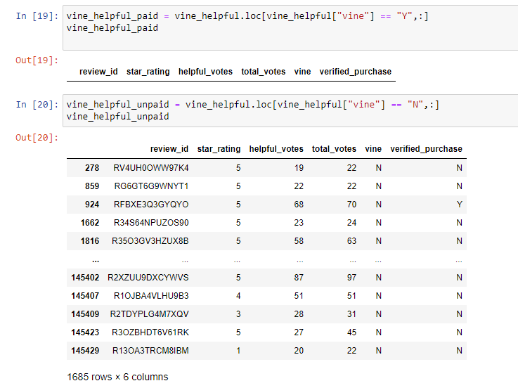
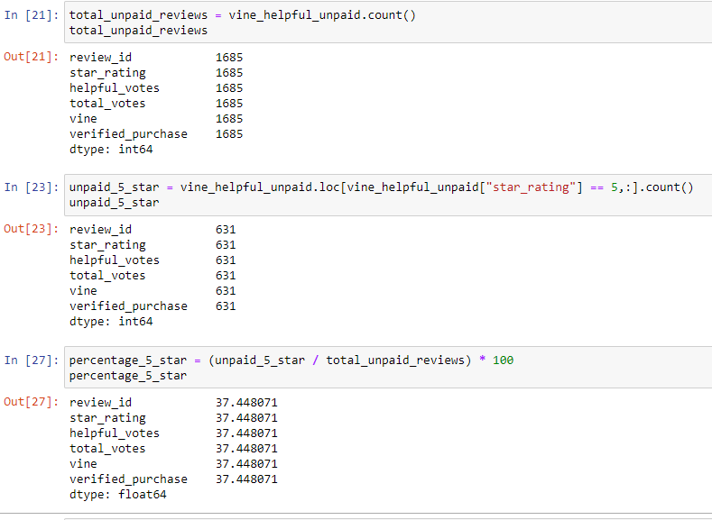

# Amazon Vine Analysis
## Overview of Analysis
In this analysis, a tsv file containing Amazon reviews of US digital video games was extracted from a S3 bucket to a PySpark dataframe and transformed into four seperate dataframes. These dataframes were loaded into tables in a SQL database, and one table showing reviews, helpfulness, and the use of the Vine program was analyzed to determine if having a paid Vine review makes a difference in the percentage of 5-star reviews. The vine dataframe was filtered to only show reviews that were voted to be "helpful", and then split into two dataframes, those that used the paid Vine program and those that didn't.
## Results

- In the [Vine review analysis](Vine_Review_Analysis.ipynb), it was found that none of the reviews deemed helpful had Vine reviews. Later inspection of the vine table csv showed that no digital video game review used the Vine program.
- Since there were no Vine reviews, we can only examine the non-Vine reviews. Of these 1685 reviews, 631 were 5-star ratings.
- The percentage of non-Vine 5-star reviews was 37.45%.
 
## Summary
Because there were no Vine reviews in the dataset, it is difficult to draw any conclusions regarding positivity bias for reviews. In order to better understand this lack of Vine reviews, I first went to Amazon's [Vine Program page](https://www.amazon.com/vine/about) to get a better idea of the purpose and usage of the Vine program. Next, I went to [Amazon's digital videogame search page](https://www.amazon.com/s?i=videogames&rh=n%3A979455011&s=review-rank&fs=true&qid=1649608588&ref=sr_pg_1) and sorted the search results by average customer review. Here it became apparent that Amazon is likely not a popular distributor of digital videogames. As of my search, nearly all of the top reviewed games with over 1,000 reviews were either **The Sims** expansion packs or XBOX Live gift cards. Since Amazon's Vine program products are "provided by publishers, labels, studios, manufacturers or any selling partner participating in the program," it is possible that digital videogame publishers do not participate in the Vine program because it is not considered a market worth investing in. I would recommend expanding the digital videogame data pool beyond the US to determine if any digital videogame reviews use the Vine program.
